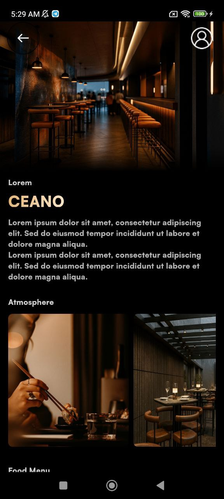
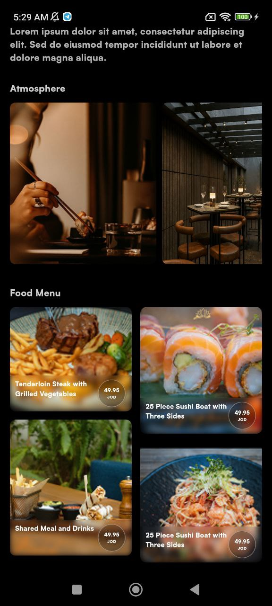
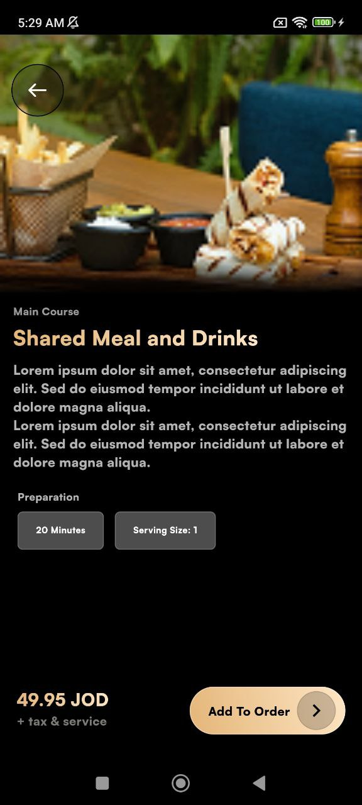

# 🍽️ Recast Designs – Flutter Technical Assessment

A **production-ready Flutter application** developed as part of the **Remote Flutter Developer Technical Assessment for Recast Designs**.

The project demonstrates **Clean Architecture**, **feature-based modular structure**, **Cubit state management**, and **responsive UI design**.

---

# 🎥 App Preview

## 📱 Screenshots

| Home Screen | Home Screen (Menu) | Food Menu Details |
|-------------|-------------------|-----------------|
|  |  |  |

---

## 🎬 App Preview Video

[▶ Watch the full app preview video](assets/readme/app_preview_video.mp4)

---

# 📦 Download APK

You can install and test the application directly:

➡ **[Download APK](assets/apk/recast_designs_app.apk)**

---

# 🎯 Overview

This project demonstrates **professional Flutter development practices** by implementing a restaurant discovery experience where users can:

• Explore restaurant details
• Browse a dynamic **food menu**
• Discover the **restaurant atmosphere**
• View **food item details**

The main goal of the project is to showcase:

✔ Scalable architecture
✔ Clean separation of concerns
✔ Modular feature development
✔ Maintainable UI structure

---

# 🏗️ Architecture

The application follows **Clean Architecture** with a **Feature-First structure**.

```
Feature
 ├── Data
 ├── Domain
 └── Presentation
```

### Layer Responsibilities

**Presentation Layer**

• UI Screens
• Cubits (State Management)
• Reusable Widgets

**Domain Layer**

• Business Logic
• Entities
• Use Cases
• Repository Contracts

**Data Layer**

• Models
• Repository Implementations
• Local Data Sources

This structure ensures **testability, maintainability, and scalability**.

---

# 📁 Project Structure

```
lib/
│
├── main.dart
│
├── app/
│   └── recast_designs.dart
│
├── core/
│   ├── routes/
│   │   └── app_router.dart
│   │
│   ├── services/
│   │   ├── device_type_service.dart
│   │   └── injection.dart
│   │
│   ├── utils/
│   │   ├── app_colors.dart
│   │   ├── app_images.dart
│   │   ├── app_strings.dart
│   │   └── app_text_styles.dart
│   │
│   └── widgets/
│       ├── back_button.dart
│       └── redacted/
│
├── features/
│
│   ├── home/
│   │   └── presentation/
│
│   ├── food_menu/
│   │   ├── data/
│   │   ├── domain/
│   │   └── presentation/
│
│   ├── atmosphere/
│   │   ├── data/
│   │   ├── domain/
│   │   └── presentation/
│
│   └── food_menu_details/
│       └── presentation/
│
└── assets/
```

Each feature contains its own **data, domain, and presentation layers**, making the application highly **modular and scalable**.

---

# 🎮 State Management

The project uses **BLoC (Cubit pattern)** for predictable state management.

Example state flow:

```
Initial
  ↓
Loading
  ↓
Success
  ↓
Error
```

### Cubits Used

• `FoodMenuCubit`
• `AtmosphereCubit`

These cubits manage the UI state and interact with the **domain layer use cases**.

---

# 💉 Dependency Injection

The project uses **GetIt** as a **service locator**.

Location:

```
core/services/injection.dart
```

Dependency chain:

```
Cubit
 ↓
UseCase
 ↓
Repository
 ↓
DataSource
```

Benefits:

• Loose coupling
• Improved testability
• Centralized dependency management

---

# 📱 Responsive Design

The application uses **flutter_screenutil** for adaptive layouts.

Features include:

• Responsive text sizing
• Device-independent layout scaling
• Support for multiple screen sizes
• Device type handling via `DeviceTypeService`

Design baseline:

```
390 x 844 (iPhone 12)
```

---

# ✨ UI Highlights

The UI focuses on **modern mobile design patterns**.

### Key Components

**Restaurant Section**

• Gradient overlay
• Hero image with fade effect
• Profile avatar overlay
• Restaurant title and description

**Food Menu**

• Masonry grid layout
• Smooth scrolling
• Image-based cards

**Atmosphere Section**

• Horizontal image gallery
• Responsive image containers

**Loading Experience**

• Skeleton loaders using `redacted`

---

# 📦 Technologies & Dependencies

| Package                     | Purpose              |
| --------------------------- | -------------------- |
| flutter_bloc                | State management     |
| get_it                      | Dependency injection |
| flutter_screenutil          | Responsive UI        |
| animate_do                  | UI animations        |
| flutter_svg                 | SVG rendering        |
| flutter_staggered_grid_view | Grid layouts         |
| redacted                    | Skeleton loaders     |

---

# 🔄 Data Flow

```
User Action
   ↓
Cubit
   ↓
Use Case
   ↓
Repository
   ↓
Local Data Source
   ↓
Mock Data
   ↓
State Emission
   ↓
UI Rebuild
```

---

# 🚀 Getting Started

### Prerequisites

Flutter SDK **3.5.3+**
Dart SDK **3.5.3+**

### Installation

```bash
git clone https://github.com/yourusername/technical_assessment_recast_designs.git

cd technical_assessment_recast_designs

flutter pub get

flutter run
```

---

# 🧪 Testing

The architecture supports:

• Unit tests for domain logic
• Widget tests for UI components
• Integration tests for feature flows

---

# 📄 Project Info

Version: **1.0.0+1**
Flutter: **3.5.3**
Dart: **3.5.3**

---

# 👨‍💻 Developer

**Eyad Khaled**
Flutter Developer

Technical Assessment for **Recast Designs**

---

⭐ If you find this project helpful, feel free to **star the repository**.
